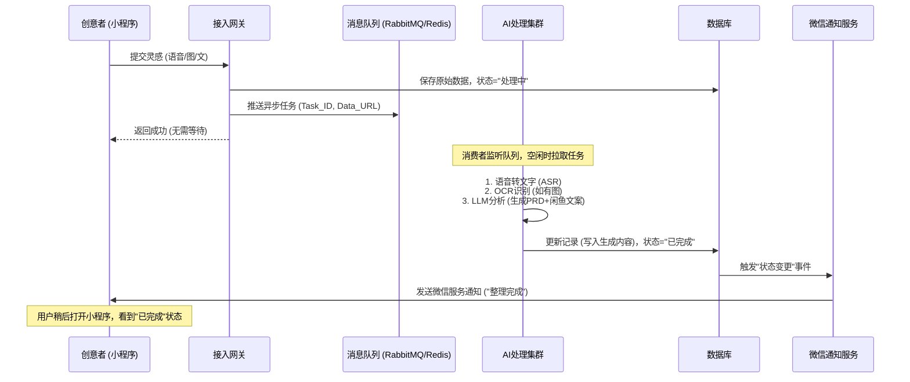

# 灵感集市-产品需求文档（PRD）

## 1. 产品概述

**产品名称**：灵感集市

**产品定位**：一个基于AI辅助的创意想法（Idea）记录与交易平台。

**核心价值**：连接"创意拥有者"与"AI开发力量"。降低创意记录门槛，利用AI将碎片化灵感转化为规范的需求文档，促进创意的商业化变现或落地开发。

**核心理念**：在AI开发门槛降低的当下，优质的Idea是稀缺资源。本平台致力于让每一个Idea都能被简单记录、被AI赋能、被市场定价。

### 1.1 背景与愿景

在AI开发能力普及的当下，"优质的创意（Idea）"成为稀缺资产。本平台旨在构建一个轻量级、自动化的创意孵化与分发网络。

- **对创意者**：利用碎片时间记录灵感，由AI自动转化为标准化的商业需求文档，降低表达门槛。
- **对实现者**：提供一个经过AI预处理、结构清晰的"高潜力项目库"，直接对接源头创意。
- **对平台**：做轻资产运营，不介入交易风险，专注于内容生产自动化与流量分发。

### 1.2 核心业务逻辑

- **输入即触发**：创意者在小程序提交任意形式的灵感（语音/图/文），立即触发后台异步任务。
- **静默处理**：后台队列自动调用AI进行转写、分析、结构化，生成标准PRD与闲鱼文案。用户无需等待，无需手动点击生成。
- **状态同步**：处理完成后，通过微信服务通知告知用户。用户再次打开即可查看成果。
- **外链交易**：用户复制AI生成的文案去闲鱼发布，回填链接后，该Idea自动同步至Web端市场供实现者浏览和跳转购买。

## 2. 用户角色与端侧职能矩阵

## 3. 功能需求详解

### 3.1 微信小程序端 (创意者工作台)

#### 3.1.1 极简录入模块 (触发器)

**设计原则**：三步以内完成记录，强调"快"。

**功能点**：
- 语音输入：长按录音，松手即提交（自动上传音频流）。
- 图片上传：支持拍照或相册选择（手绘草图、截图）。
- 文本备注：可选的简短文字补充。
- 提交反馈：点击提交后，界面立即提示："灵感已接收，AI正在后台为您整理，完成后将微信通知您。"用户可直接关闭小程序。

#### 3.1.2 异步状态管理中心

**灵感列表页**：
- 展示所有历史灵感条目。
- 动态状态标签：
  - 🟡 处理中：后台队列排队或AI计算中。
  - 🟢 已完成：AI已生成完整文档，可操作。
  - 🔴 异常：内容违规或识别失败（显示具体原因）。

**通知机制**：
- 集成微信服务通知。当状态变更为"已完成"时，主动推送模板消息："您的灵感《[自动生成的标题]》已整理完毕，点击查看文案。"

#### 3.1.3 成果交付(核心转化)

1）可以挂上微信号/闲鱼号（默认）
2）与闲鱼联动

**详情页 (状态=已完成)**：
- **AI生成内容展示**：
  - 闲鱼标题：极具吸引力的商品标题。
  - 闲鱼详情文案：结构化描述（痛点、解决方案、核心功能、适用人群），格式适配闲鱼阅读习惯。
  - 内部PRD：更详细的技术逻辑、功能列表（供创意者自查）。
- **操作动作**：
  - [一键复制]：将标题+详情文案复制到剪贴板。
  - [去闲鱼发布]：尝试唤起闲鱼App跳转至发布页。
  - [回填链接]：输入框，粘贴已发布的闲鱼商品URL。

**上架逻辑**：
- 只有当用户成功回填有效的闲鱼链接并点击"同步上架"后，该数据才会被推送到Web端市场展示。

### 3.2 Web 端 (实现者采购市场)

#### 3.2.1 只读市场浏览

**数据源**：仅展示"已完成AI整理"且"已回填闲鱼链接"的有效Idea。

**首页/列表页**：
- 卡片式展示：标题、行业标签、AI评分、闲鱼标价、更新时间。
- 高级筛选：按价格区间、技术栈（如Python/Node.js）、开发难度、交易类型（买断/定制）筛选。
- 搜索功能：支持对AI生成的结构化文档内容进行全文检索。

#### 3.2.2 项目详情页 (脱敏引流)

**公开信息区**：
- 项目背景与核心价值。
- 核心功能清单（展示约40%的关键功能，隐藏核心逻辑细节）。
- AI评估的开发周期与成本建议。
- 创意者信誉标识（如有）。

**交易引导区 (CTA)**：
- 醒目按钮："去闲鱼购买源码/方案"。
- 交互：点击按钮直接新窗口打开对应的闲鱼商品链接。
- 提示文案："完整需求文档、源码交付及资金担保请在闲鱼平台与卖家沟通。"

#### 3.2.3 严格的发布限制

- **物理隔离**：Web端导航栏、Footer、个人中心彻底移除"发布"、"上传"、"创建"等入口。
- **接口防护**：后端API针对Web端来源的发布请求直接返回 403 Forbidden，并在日志记录异常IP。

## 4. 后台异步处理架构 (核心逻辑)

本系统采用 事件驱动 (Event-Driven) 架构，确保高并发下的稳定性与低成本。

### 4.1 处理流程图

### 4.2 关键机制

- **削峰填谷**：利用消息队列缓冲突发流量，避免AI API超时报错。
- **自动重试**：若AI调用失败（网络波动等），自动重试3次；仍失败则标记为"异常"并通知用户。
- **内容风控**：在AI处理前增加一层轻量级敏感词/违禁图过滤，违规内容直接标记为"审核不通过"，不进入AI处理队列。

## 5. 非功能性需求

### 5.1 性能指标

- **提交响应**：小程序端提交动作响应时间 < 500ms。
- **处理时效**：95%的任务在 3分钟 内完成处理（视队列长度动态调整）。
- **通知延迟**：处理完成后，微信通知到达延迟 < 10秒。

### 5.2 数据安全

- **隐私保护**：用户的原始语音/图片加密存储；未回填闲鱼链接前，数据不对Web端可见。
- **防爬取**：Web端详情页实施动态水印，禁止右键复制核心内容，限制单IP高频访问。
- **链接监测**：后台每日定时巡检回填的闲鱼链接，若发现商品下架/删除，自动将Web端对应Idea下架或标记"已售出"。

### 5.3 兼容性

- **小程序**：兼容主流iOS/Android微信版本。
- **Web端**：适配Chrome, Edge, Safari, Firefox，支持响应式布局（但在手机端访问Web时，强引导跳转小程序）。

## 6. 运营与盈利模式 (轻资产版)

由于不介入交易资金流，平台通过增值服务盈利：

- **AI算力订阅 (SaaS)**：
  - 免费版：每月免费处理 5 条灵感，标准队列速度。
  - Pro会员 (¥9.9/月)：无限条数，优先队列（处理更快），解锁"商业模式分析"、"竞品分析"等高级AI报告模板。
- **流量推广服务**：
  - Web端置顶：创意者付费（如 ¥5/天），使其回填链接后的Idea在Web端首页置顶展示，增加闲鱼曝光率。
- **数据洞察报告**：
  - 定期向会员推送"本周热门Idea趋势"，指导创意者创作更易变现的内容。

## 7. 项目实施路线图 (Roadmap)

## 8. 附录：AI 生成内容标准 (示例)

为保证输出质量，后台AI需遵循以下输出结构：

**闲鱼标题**：[痛点/场景] + [核心功能] + [现成方案/源码] (例：社区团购小程序源码！含分销裂变功能，适合初创团队快速落地)

**闲鱼详情**：
- 【项目背景】：一句话描述解决什么问题。
- 【核心功能】：列出3-5个关键功能点。
- 【技术栈建议】：推荐的前后端技术。
- 【适用人群】：谁适合买这个方案。
- 【交付内容】：文档/原型/源码（由卖家在闲鱼自行定义）。

**内部PRD**：
- 用户故事地图。
- 详细功能列表。
- 数据库ER图建议。
- UI/UX 布局建议。

## 文档结语

本PRD定义的"灵感集市 V3.0"是一个极致轻量化的平台。它通过将复杂的AI处理后置为异步任务，将重资产的交易环节外包给闲鱼，实现了最低的开发成本与最高的用户记录体验。小程序是创意的"捕手"，Web是价值的"展台"，两者通过异步数据流完美协同。